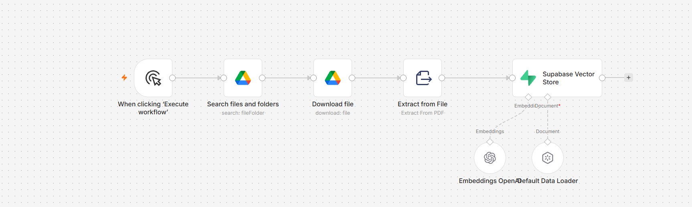
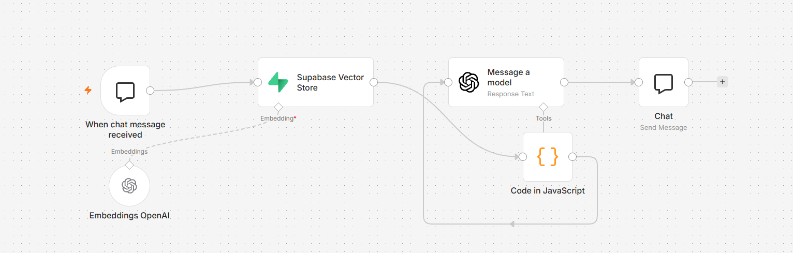
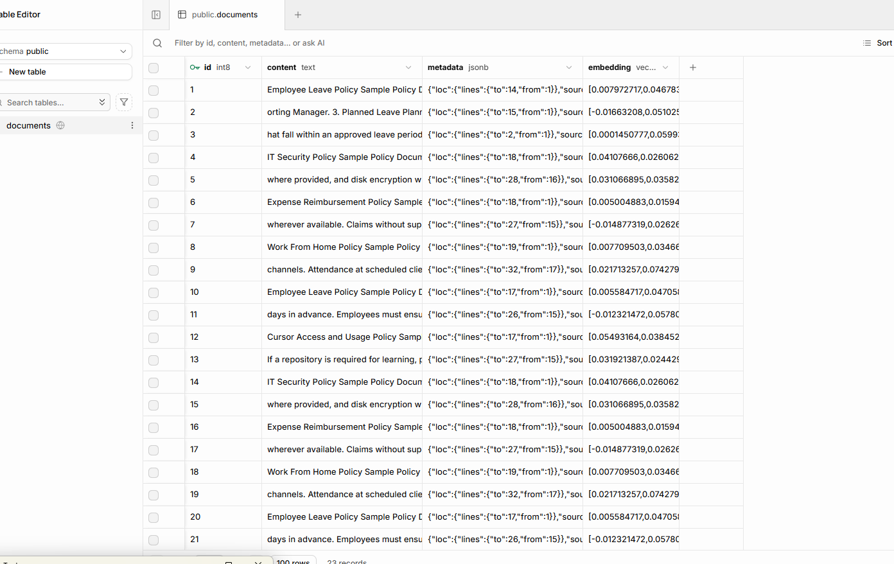
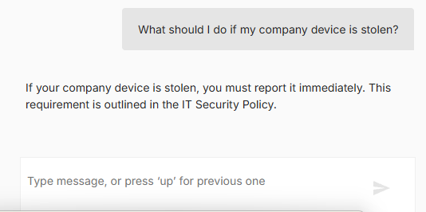
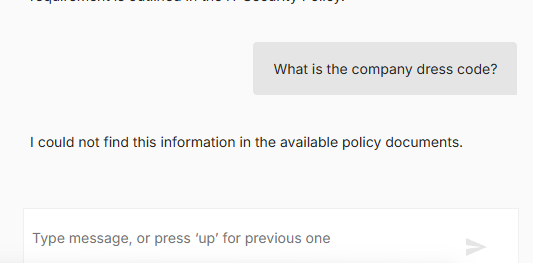

# AI Company Policy Assistant — RAG with n8n, Supabase pgvector & OpenAI

A practical Retrieval-Augmented Generation (RAG) project that turns a folder of company policy PDFs into an interactive policy assistant.

The assistant retrieves relevant policy chunks from a Supabase vector database, answers only from the retrieved context, cites the source document, and returns a safe fallback when the answer is not present in the knowledge base.

> **Portfolio note:** This repository uses synthetic/sample policy documents only. No confidential employer or client documents are included.

## What this project solves

Employees often need quick answers from internal policy documents such as:

- Leave policy
- Work-from-home policy
- IT security policy
- Expense reimbursement policy
- AI/coding-tool usage policy

Searching PDFs manually is slow. This workflow makes those documents searchable through natural-language chat.

## Architecture

### 1. Document ingestion

```text
Manual Trigger
   ↓
Google Drive — Search policy PDFs
   ↓
Google Drive — Download each PDF
   ↓
Extract From File — PDF text extraction
   ↓
Default Data Loader — chunking + source metadata
   ↓
OpenAI Embeddings
   ↓
Supabase Vector Store / pgvector
```



### 2. Question answering

```text
Chat Trigger
   ↓
OpenAI Embedding for the user question
   ↓
Supabase Vector Store — similarity search
   ↓
JavaScript — score threshold + context aggregation
   ↓
OpenAI chat model — grounded answer
   ↓
Chat response
```



## Vector database

Policy chunks are stored in Supabase PostgreSQL using `pgvector`.

Each row stores:

- `content` — chunk text
- `metadata` — source filename and chunk information
- `embedding` — vector representation used for semantic similarity search



## Grounded response example

The assistant retrieves the relevant policy before answering:



## Hallucination / fallback handling

A similarity threshold is applied before context is sent to the LLM.

When the knowledge base does not contain an answer, the assistant returns:

> I could not find this information in the available policy documents.



## RAG flow

1. PDFs are downloaded from Google Drive.
2. Text is extracted from each PDF.
3. Documents are split into smaller chunks.
4. Each chunk receives `source` metadata.
5. OpenAI creates embeddings.
6. Embeddings and text are stored in Supabase pgvector.
7. A chat question is converted into an embedding using the same embedding model.
8. Supabase performs semantic similarity search.
9. Low-confidence matches are removed using a similarity threshold.
10. Relevant chunks are combined into context.
11. The LLM is instructed to answer only from that context.
12. The answer includes the source policy filename.

## Tech stack

| Technology | Purpose |
|---|---|
| n8n | Workflow orchestration |
| Supabase | PostgreSQL database |
| pgvector | Vector storage and similarity search |
| OpenAI Embeddings | Semantic embeddings |
| OpenAI Chat Model | Grounded answer generation |
| Google Drive | Policy document source |
| JavaScript | Context building and score filtering |

## Example questions

```text
How many casual leave days do employees get?
Can employees share Cursor accounts?
Where should API keys and secrets be stored?
How many days do I have to submit an expense claim?
Can I work from home for more than 10 consecutive working days?
What should I do if my company device is stolen?
```

Negative test:

```text
What is the company dress code?
```

Expected result:

```text
I could not find this information in the available policy documents.
```

## Similarity threshold

The workflow filters retrieved chunks before sending context to the model.

```javascript
const MIN_SCORE = 0.35;

const relevant = $input.all().filter(item =>
  (item.json.score ?? 0) >= MIN_SCORE
);
```

The threshold should be tuned using a representative evaluation set rather than treated as a universal value.

## Supabase schema

```sql
create extension if not exists vector;

create table if not exists documents (
  id bigserial primary key,
  content text not null,
  metadata jsonb,
  embedding vector(1536)
);
```

The project uses a matching RPC compatible with the n8n Supabase Vector Store node:

```sql
create or replace function public.match_documents(
  query_embedding vector(1536),
  match_count int default 5,
  filter jsonb default '{}'
)
returns table (
  id bigint,
  content text,
  metadata jsonb,
  similarity float
)
language plpgsql
as $$
#variable_conflict use_column
begin
  return query
  select
    documents.id,
    documents.content,
    documents.metadata,
    1 - (documents.embedding <=> query_embedding) as similarity
  from documents
  where documents.metadata @> filter
  order by documents.embedding <=> query_embedding
  limit match_count;
end;
$$;
```

## Security notes

- Do not commit API keys, Supabase secret/service-role keys, or n8n credentials.
- Do not upload confidential company/client documents to a public repository.
- Use synthetic documents for public demos.
- For real internal documents, use an environment and AI providers approved by the organization.
- Keep Row Level Security and backend access controls appropriate for the deployment.

## What I learned

This project provided hands-on experience with:

- Retrieval-Augmented Generation (RAG)
- Embeddings and semantic search
- Vector databases and pgvector
- Document ingestion and chunking
- Metadata-aware retrieval
- n8n AI workflow orchestration
- Structured context construction
- Similarity-score filtering
- Prompt grounding
- Source attribution
- Hallucination fallback behavior

## Possible next improvements

- Conversation memory
- Authentication and role-based document access
- Metadata filters by department/policy type
- Hybrid keyword + vector retrieval
- Reranking
- Automated document re-indexing when Drive files change
- Evaluation dataset with retrieval/answer quality metrics
- Web frontend instead of the built-in n8n chat
- Clickable document/page citations

## Status

✅ Multi-PDF ingestion  
✅ PDF extraction  
✅ Chunking  
✅ Embeddings  
✅ Supabase pgvector storage  
✅ Semantic retrieval  
✅ Source metadata  
✅ Similarity threshold  
✅ Grounded LLM answers  
✅ Fallback for unsupported questions  
✅ Interactive chat workflow
